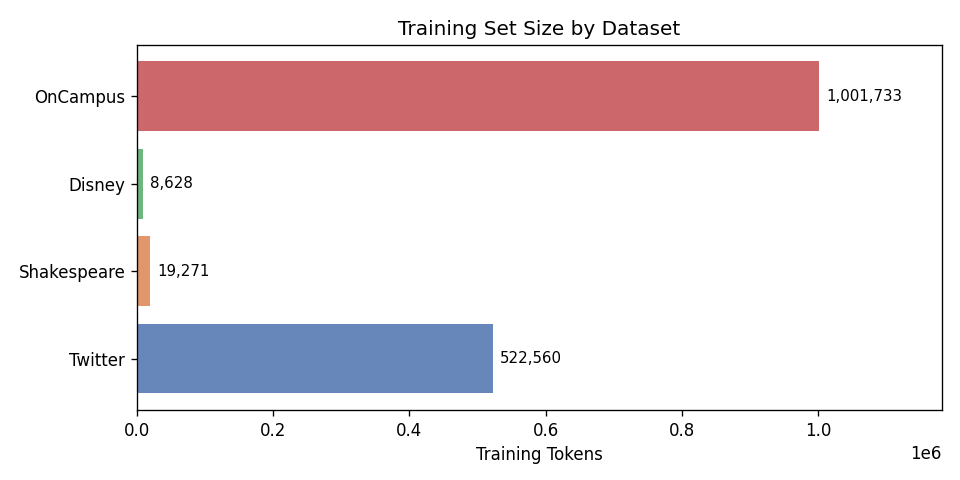
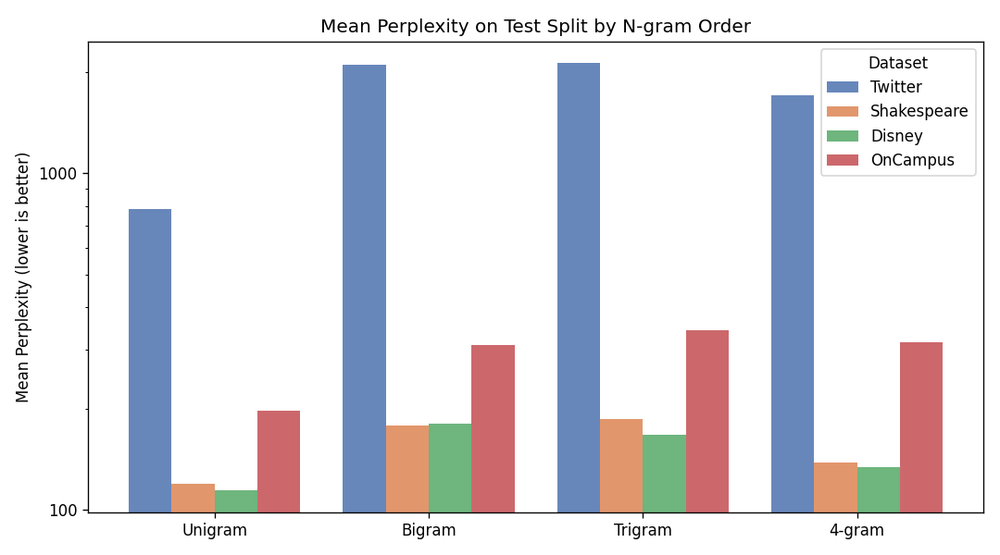
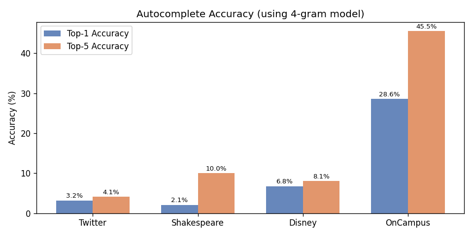

# N-gram Autocomplete Language Model — Multi-Dataset Analysis Report

**Generated:** 2026-02-27 13:52 UTC

---

## Project Overview

This project implements an **N-gram language model** for word-autocomplete.  
The pipeline (defined in `data_preprocessing.py` and `language_model.py`):

1. **Tokenisation** — sentences are split on newlines, lowercased, and tokenised
   with NLTK's `word_tokenize`.
2. **Vocabulary building** — a *closed vocabulary* is derived from training data
   by keeping only words that appear at least `minimum_freq` (default: 2) times.
   All other words are replaced by `<unk>`.
3. **N-gram counting** — `count_n_grams(data, n)` prepends `n` start tokens
   `<s>` and one end token `<e>` to every sentence, then slides a window of
   size `n` to accumulate counts.
4. **Probability estimation** — add-*k* (Laplace) smoothing with default `k=1`:

   ```
   P(w | context) = (C(context, w) + k) / (C(context) + k * |V|)
   ```

   where `|V|` includes `<e>` and `<unk>`.
5. **Word suggestion** — the word with the highest smoothed probability given
   the last *n−1* tokens is returned as the top-1 suggestion.
6. **Perplexity** — geometric-mean inverse probability over a held-out sentence:

   ```
   PP(W) = [ prod_t 1/P(w_t | context_t) ]^(1/N)
   ```

No back-off or interpolation is applied; each n-gram order is a standalone
model.  The analysis runner (this script) uses the **4-gram model**
for autocomplete evaluation (a (4+1)-gram count table is also built
to allow perplexity computation for the 4-gram model).

---

## How to Run

### Install dependencies
```bash
pip install nltk numpy pandas matplotlib
```

### Run on default datasets (Twitter, Shakespeare/Merchant, Disney, OnCampus)
```bash
python -m analysis.run
```

### Run on custom datasets (name:path pairs)
```bash
python -m analysis.run \
    --dataset Twitter:data/en_US.twitter.txt \
    --dataset Disney:data/disney.txt
```

### Run on an external dataset
```bash
python -m analysis.run --dataset MyCorpus:/path/to/corpus.txt
```

**Expected format:** plain-text file, one sentence per line, UTF-8 encoding.

Artefacts are written to:
- `reports/artifacts/metrics.csv`
- `reports/artifacts/metrics.json`

---

## Experimental Settings

| Parameter | Value |
|-----------|-------|
| Random seed | 87 |
| Train / Valid / Test split | 70% / 15% / 15% |
| Minimum word frequency (vocabulary) | 2 |
| Add-*k* smoothing constant | 1.0 |
| N-gram orders evaluated | 1 – 4 |
| Max sentences for perplexity / autocomplete eval | 500 |

---

## Dataset: Twitter

**File:** `data/en_US.twitter.txt`

### Size & Vocabulary

| Metric | Value |
|--------|-------|
| Training sentences | 33,572 |
| Validation sentences | 7,194 |
| Test sentences | 7,195 |
| Training tokens | 522,560 |
| Test tokens | 111,437 |
| Vocabulary size | 13,651 |
| OOV rate (test) | 5.48% |

### N-gram Type Counts (Sparsity)

| N-gram Order | Unique Types |
|--------------|-------------|
| Unigram | 13,654 |
| Bigram | 189,191 |
| Trigram | 384,641 |
| 4-gram | 469,059 |
| 5-gram | 491,051 |

### Top N-grams

**Top-10 Unigrams**

| Rank | N-gram | Count |
|------|--------|-------|
| 1 | `.` | 20621 |
| 2 | `<unk>` | 19890 |
| 3 | `!` | 18205 |
| 4 | `the` | 13324 |
| 5 | `i` | 13006 |
| 6 | `to` | 11120 |
| 7 | `,` | 10659 |
| 8 | `a` | 8671 |
| 9 | `you` | 8609 |
| 10 | `and` | 6210 |

**Top-10 Bigrams**

| Rank | N-gram | Count |
|------|--------|-------|
| 1 | `! !` | 4484 |
| 2 | `i 'm` | 1853 |
| 3 | `# <unk>` | 1732 |
| 4 | `<unk> .` | 1554 |
| 5 | `: )` | 1379 |
| 6 | `it 's` | 1220 |
| 7 | `. i` | 1133 |
| 8 | `in the` | 1117 |
| 9 | `do n't` | 1072 |
| 10 | `for the` | 1052 |

**Top-10 Trigrams**

| Rank | N-gram | Count |
|------|--------|-------|
| 1 | `! ! !` | 2009 |
| 2 | `i do n't` | 356 |
| 3 | `thanks for the` | 329 |
| 4 | `! : )` | 271 |
| 5 | `ca n't wait` | 206 |
| 6 | `i ca n't` | 203 |
| 7 | `: - )` | 203 |
| 8 | `<unk> ! !` | 192 |
| 9 | `. i 'm` | 175 |
| 10 | `? ? ?` | 174 |

### Perplexity on Test Split (500 sentences max)

| N-gram Order | Mean Perplexity |
|--------------|-----------------|
| Unigram | 784.30 |
| Bigram | 2108.46 |
| Trigram | 2131.67 |
| 4-gram | 1706.02 |

### Autocomplete Accuracy (using 4-gram model, 500 sentences max)

| Metric | Value |
|--------|-------|
| Top-1 accuracy | 3.20% |
| Top-5 accuracy | 4.13% |
| Mean log-probability of true word | -9.4971 |
| Number of prediction instances | 7,334 |

### Qualitative Examples

**Good predictions** (model top-1 = true next word):

| Prefix (last 4 tokens) | True word | Predicted | Probability |
|------------------------|-----------|-----------|-------------|
| `thank you ! glad` | **you** | you | 0.000146 |
| `haha you know` | **i** | i | 0.000073 |
| `<unk> is more exercise` | **i** | i | 0.000073 |
| `<unk> with myself that` | **i** | i | 0.000073 |
| `i do n't wan` | **na** | na | 0.000659 |

**Bad predictions** (model top-1 ≠ true next word):

| Prefix (last 4 tokens) | True word | Predicted | Probability |
|------------------------|-----------|-----------|-------------|
| `know it was n't` | **you** | i | 0.000073 |
| `amazing . you completely` | **changed** | i | 0.000073 |
| `been out in vegas` | **working** | i | 0.000073 |
| `still hot in #` | **atl** | i | 0.000073 |
| `<unk> is in the` | **building** | works | 0.000146 |

---

## Dataset: Shakespeare

**File:** `data/merchant.txt`

### Size & Vocabulary

| Metric | Value |
|--------|-------|
| Training sentences | 2,169 |
| Validation sentences | 464 |
| Test sentences | 466 |
| Training tokens | 19,271 |
| Test tokens | 4,261 |
| Vocabulary size | 1,097 |
| OOV rate (test) | 11.48% |

### N-gram Type Counts (Sparsity)

| N-gram Order | Unique Types |
|--------------|-------------|
| Unigram | 1,100 |
| Bigram | 8,599 |
| Trigram | 14,867 |
| 4-gram | 16,994 |
| 5-gram | 17,500 |

### Top N-grams

**Top-10 Unigrams**

| Rank | N-gram | Count |
|------|--------|-------|
| 1 | `<unk>` | 1476 |
| 2 | `,` | 1416 |
| 3 | `.` | 1341 |
| 4 | `the` | 566 |
| 5 | `i` | 492 |
| 6 | `and` | 425 |
| 7 | `’` | 361 |
| 8 | `of` | 324 |
| 9 | `to` | 321 |
| 10 | `you` | 318 |

**Top-10 Bigrams**

| Rank | N-gram | Count |
|------|--------|-------|
| 1 | `<unk> ,` | 200 |
| 2 | `the <unk>` | 153 |
| 3 | `’ d` | 129 |
| 4 | `<unk> .` | 126 |
| 5 | `, and` | 124 |
| 6 | `<unk> <unk>` | 110 |
| 7 | `’ s` | 104 |
| 8 | `portia .` | 92 |
| 9 | `<unk> of` | 86 |
| 10 | `<unk> ’` | 85 |

**Top-10 Trigrams**

| Rank | N-gram | Count |
|------|--------|-------|
| 1 | `<unk> ’ d` | 57 |
| 2 | `i ’ ll` | 34 |
| 3 | `<unk> , and` | 30 |
| 4 | `the <unk> of` | 27 |
| 5 | `<unk> <unk> ,` | 23 |
| 6 | `the <unk> <unk>` | 20 |
| 7 | `, and <unk>` | 18 |
| 8 | `<unk> and <unk>` | 17 |
| 9 | `’ s house` | 16 |
| 10 | `, sir ,` | 16 |

### Perplexity on Test Split (500 sentences max)

| N-gram Order | Mean Perplexity |
|--------------|-----------------|
| Unigram | 119.68 |
| Bigram | 178.23 |
| Trigram | 185.74 |
| 4-gram | 138.34 |

### Autocomplete Accuracy (using 4-gram model, 500 sentences max)

| Metric | Value |
|--------|-------|
| Top-1 accuracy | 2.06% |
| Top-5 accuracy | 9.99% |
| Mean log-probability of true word | -6.9815 |
| Number of prediction instances | 3,795 |

### Qualitative Examples

**Good predictions** (model top-1 = true next word):

| Prefix (last 4 tokens) | True word | Predicted | Probability |
|------------------------|-----------|-----------|-------------|
| `scene iv . the` | **same** | same | 0.001818 |
| `<unk> ’ d by` | **the** | the | 0.001817 |
| `the prince of morocco` | **,** | , | 0.001817 |
| `scene iii . venice` | **.** | . | 0.002725 |
| `chooseth me shall get` | **as** | as | 0.003630 |

**Bad predictions** (model top-1 ≠ true next word):

| Prefix (last 4 tokens) | True word | Predicted | Probability |
|------------------------|-----------|-----------|-------------|
| `<unk> me to` | **your** | when | 0.000910 |
| `the wish would make` | **else** | when | 0.000910 |
| `one speak for both` | **.** | when | 0.000910 |
| `<unk> to my <unk>` | **,** | when | 0.000910 |
| `<unk> like his <unk>` | **cut** | when | 0.000910 |

---

## Dataset: Disney

**File:** `data/disney.txt`

### Size & Vocabulary

| Metric | Value |
|--------|-------|
| Training sentences | 347 |
| Validation sentences | 74 |
| Test sentences | 76 |
| Training tokens | 8,628 |
| Test tokens | 2,596 |
| Vocabulary size | 656 |
| OOV rate (test) | 14.45% |

### N-gram Type Counts (Sparsity)

| N-gram Order | Unique Types |
|--------------|-------------|
| Unigram | 659 |
| Bigram | 4,359 |
| Trigram | 7,306 |
| 4-gram | 8,257 |
| 5-gram | 8,464 |

### Top N-grams

**Top-10 Unigrams**

| Rank | N-gram | Count |
|------|--------|-------|
| 1 | `<unk>` | 797 |
| 2 | `,` | 739 |
| 3 | `the` | 402 |
| 4 | `and` | 328 |
| 5 | `.` | 285 |
| 6 | `to` | 198 |
| 7 | `she` | 181 |
| 8 | `her` | 158 |
| 9 | `a` | 153 |
| 10 | `was` | 132 |

**Top-10 Bigrams**

| Rank | N-gram | Count |
|------|--------|-------|
| 1 | `, and` | 168 |
| 2 | `<unk> ,` | 147 |
| 3 | `<unk> .` | 63 |
| 4 | `the <unk>` | 61 |
| 5 | `and <unk>` | 53 |
| 6 | `, <unk>` | 53 |
| 7 | `<unk> <unk>` | 52 |
| 8 | `a <unk>` | 45 |
| 9 | `<unk> and` | 41 |
| 10 | `<unk> of` | 39 |

**Top-10 Trigrams**

| Rank | N-gram | Count |
|------|--------|-------|
| 1 | `<unk> , and` | 46 |
| 2 | `<unk> and <unk>` | 21 |
| 3 | `<unk> , <unk>` | 17 |
| 4 | `, ( said` | 14 |
| 5 | `the <unk> of` | 14 |
| 6 | `, <unk> ,` | 14 |
| 7 | `the <unk> ,` | 12 |
| 8 | `a <unk> ,` | 12 |
| 9 | `, and <unk>` | 12 |
| 10 | `<unk> . ''` | 11 |

### Perplexity on Test Split (500 sentences max)

| N-gram Order | Mean Perplexity |
|--------------|-----------------|
| Unigram | 113.97 |
| Bigram | 180.11 |
| Trigram | 166.71 |
| 4-gram | 133.91 |

### Autocomplete Accuracy (using 4-gram model, 500 sentences max)

| Metric | Value |
|--------|-------|
| Top-1 accuracy | 6.75% |
| Top-5 accuracy | 8.06% |
| Mean log-probability of true word | -6.4650 |
| Number of prediction instances | 2,520 |

### Qualitative Examples

**Good predictions** (model top-1 = true next word):

| Prefix (last 4 tokens) | True word | Predicted | Probability |
|------------------------|-----------|-----------|-------------|
| `child was <unk> ,` | **the** | the | 0.001520 |
| `so it had .` | **the** | the | 0.001520 |
| `she <unk> her <unk>` | **,** | , | 0.004545 |
| `seven mountains to the` | **seven** | seven | 0.003035 |
| `looking-glass , looking-glass ,` | **on** | on | 0.010542 |

**Bad predictions** (model top-1 ≠ true next word):

| Prefix (last 4 tokens) | True word | Predicted | Probability |
|------------------------|-----------|-----------|-------------|
| `and kind that it` | **made** | the | 0.001520 |
| `took the poisonous <unk>` | **.** | the | 0.001520 |
| `, but never think` | **of** | the | 0.001520 |
| `<unk> her wand .` | **immediately** | the | 0.001520 |
| `[ illustration : beauty` | **<unk>** | at | 0.003026 |

---

## Dataset: OnCampus

**File:** `data/oncampus_no_numbers.txt`

### Size & Vocabulary

| Metric | Value |
|--------|-------|
| Training sentences | 65,683 |
| Validation sentences | 14,074 |
| Test sentences | 14,076 |
| Training tokens | 1,001,733 |
| Test tokens | 214,492 |
| Vocabulary size | 11,997 |
| OOV rate (test) | 1.87% |

### N-gram Type Counts (Sparsity)

| N-gram Order | Unique Types |
|--------------|-------------|
| Unigram | 12,000 |
| Bigram | 148,325 |
| Trigram | 316,003 |
| 4-gram | 409,583 |
| 5-gram | 453,989 |

### Top N-grams

**Top-10 Unigrams**

| Rank | N-gram | Count |
|------|--------|-------|
| 1 | `:` | 108340 |
| 2 | `,` | 64415 |
| 3 | `-` | 52524 |
| 4 | `//` | 50780 |
| 5 | `pm` | 43571 |
| 6 | `+` | 36370 |
| 7 | `the` | 18013 |
| 8 | `krea` | 15567 |
| 9 | `to` | 15154 |
| 10 | `am` | 14338 |

**Top-10 Bigrams**

| Rank | N-gram | Count |
|------|--------|-------|
| 1 | `, :` | 50809 |
| 2 | `// ,` | 50755 |
| 3 | `: pm` | 38460 |
| 4 | `pm -` | 37396 |
| 5 | `- +` | 35352 |
| 6 | `+ :` | 34789 |
| 7 | `krea :` | 14674 |
| 8 | `: am` | 13733 |
| 9 | `am -` | 13406 |
| 10 | `: <` | 4861 |

**Top-10 Trigrams**

| Rank | N-gram | Count |
|------|--------|-------|
| 1 | `// , :` | 50754 |
| 2 | `, : pm` | 37413 |
| 3 | `: pm -` | 37391 |
| 4 | `- + :` | 34789 |
| 5 | `pm - +` | 26100 |
| 6 | `: am -` | 13404 |
| 7 | `, : am` | 13388 |
| 8 | `am - +` | 9234 |
| 9 | `: < media` | 4858 |
| 10 | `< media omitted` | 4858 |

### Perplexity on Test Split (500 sentences max)

| N-gram Order | Mean Perplexity |
|--------------|-----------------|
| Unigram | 196.96 |
| Bigram | 308.04 |
| Trigram | 341.86 |
| 4-gram | 314.10 |

### Autocomplete Accuracy (using 4-gram model, 500 sentences max)

| Metric | Value |
|--------|-------|
| Top-1 accuracy | 28.57% |
| Top-5 accuracy | 45.52% |
| Mean log-probability of true word | -7.3599 |
| Number of prediction instances | 7,138 |

### Qualitative Examples

**Good predictions** (model top-1 = true next word):

| Prefix (last 4 tokens) | True word | Predicted | Probability |
|------------------------|-----------|-----------|-------------|
| `- + : when` | **does** | does | 0.004293 |
| `// , : pm` | **-** | - | 0.756963 |
| `, : am -` | **+** | + | 0.363798 |
| `// , : pm` | **-** | - | 0.756963 |
| `// , : pm` | **-** | - | 0.756963 |

**Bad predictions** (model top-1 ≠ true next word):

| Prefix (last 4 tokens) | True word | Predicted | Probability |
|------------------------|-----------|-----------|-------------|
| `willing to do so` | **!** | instagram | 0.000083 |
| `if u haven ’` | **t** | instagram | 0.000083 |
| `continuing covid situation ,` | **and** | instagram | 0.000083 |
| `anushka agarwal krea :` | **anybody** | this | 0.000829 |
| `.` | **tanvi** | instagram | 0.000083 |

---

## Cross-Dataset Comparison

### Summary Table

| Dataset | Vocab | OOV% | Unigram PP | Bigram PP | Trigram PP | 4-gram PP | Top-1 Acc | Top-5 Acc |
|---------|-------|------|------------|-----------|------------|-----------------|-----------|-----------|
| Twitter | 13,651 | 5.5% | 784.3 | 2108.5 | 2131.7 | 1706.0 | 3.20% | 4.13% |
| Shakespeare | 1,097 | 11.5% | 119.7 | 178.2 | 185.7 | 138.3 | 2.06% | 9.99% |
| Disney | 656 | 14.4% | 114.0 | 180.1 | 166.7 | 133.9 | 6.75% | 8.06% |
| OnCampus | 11,997 | 1.9% | 197.0 | 308.0 | 341.9 | 314.1 | 28.57% | 45.52% |

### Discussion

**Why results differ across datasets:**

- **Vocabulary size and domain** — Larger, more diverse corpora (e.g., Twitter)
  produce larger vocabularies and higher perplexity because the model must
  spread probability mass over many more words.
- **OOV rate** — Corpora with richer vocabulary relative to the training set
  size will have higher OOV rates on the test split, which raises perplexity
  because unseen words receive only the smoothed floor probability.
- **Sentence length and structure** — Short, informal sentences (Twitter) have
  fewer high-order n-gram matches, limiting the benefit of higher-order models.
  Structured narrative text (Shakespeare) shows more consistent phrasing,
  allowing higher-order n-grams to be more informative.
- **Data sparsity** — Small corpora (Disney) have very few training sentences,
  leading to sparse n-gram tables.  With add-k smoothing this flattens
  probability distributions and can raise perplexity.
- **Top-1 / Top-5 accuracy** — Datasets with highly repetitive phrasing will
  yield higher autocomplete accuracy because the most-frequent next word is
  often the true next word.

**Limitations:**

- Only add-k (Laplace) smoothing is used; no back-off or Kneser-Ney smoothing.
- No neural or sub-word models are evaluated.
- Perplexity is computed per-token with start/end markers, not per-word, so
  values are not directly comparable to standard benchmarks.
- The autocomplete evaluation uses the closed vocabulary, so OOV test words can
  never be the predicted word even if the model assigns them probability via
  the `<unk>` token.

**Next steps:**

1. Implement Kneser-Ney or Witten-Bell smoothing for better generalisation.
2. Add interpolation across n-gram orders.
3. Evaluate on held-out splits from the *same* domain used for training.
4. Explore neural language models (LSTM, Transformer) as baselines.
5. Add a web-based demo interface.


## Figures

### Training Set Sizes



### Perplexity by N-gram Order



### Autocomplete Accuracy


